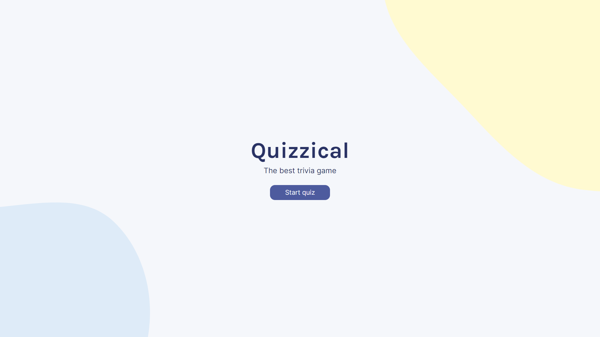
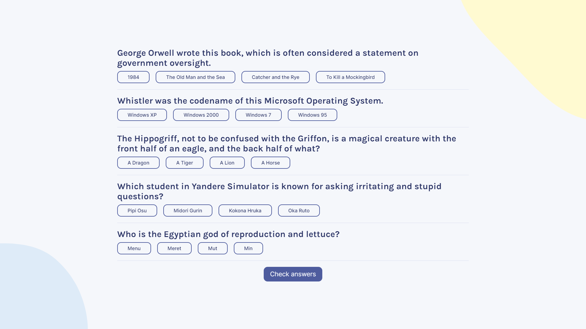
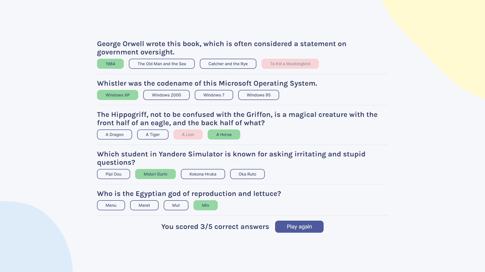

# Quizzical

### A trivia game made with _React_.

- Each quiz consists of questions from random topics and difficulties.

- The questions are fetched from [Open Trivia DB](https://opentdb.com/api_config.php).

- Mobile view is supported.

Image examples:

---

---

### Setup

#### Requirements

`NodeJS` and `npm`.

- For easily managing `NodeJS` and `npm` installations, use [`nvm`
  (Node Version Manager)](https://github.com/nvm-sh/nvm)

#### Step-by-step instructions

1. Run `npm install` to install the dependencies
2. Run `npm run dev` to start the application
